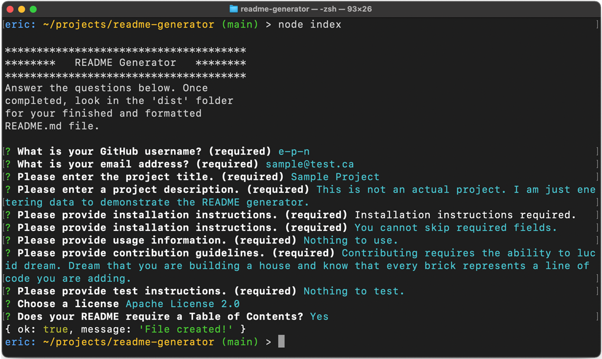

# README Generator
## Description
Application for creating project README&#46;md files. Answer a series of questions and the application builds a formatted README&#46;md file for you. 

## Installation
1. [Click here](https://github.com/e-p-n/readme-generator) to find the README Generator repository. Click on the "code" button and copy the link to clone the repo.
2. In your terminal/bash app, navigate to the folder where you want to install README Generator. Clone the application by typing "git clone" and then pasting the link you copied in step 1.
3. Install the package managers by typing "npm install" in your terminal/bash app. If this works correctly you will have a "node_modules" folder added inside the folder where you have installed the app.

## Usage
1. In your terminal/bash window type "node index" or "node index.js" to launch the app.
2. Answer the question prompts in the terminal/bash window. 
3. Navigate to the "dist" folder inside the apps main folder. Inside you will find a completed README&#46;md file.

[Click here](https://drive.google.com/file/d/1PlKO5b8YU-7QcVklhIiEAgHgpdY9BI0W/view) to watch a sample video.

